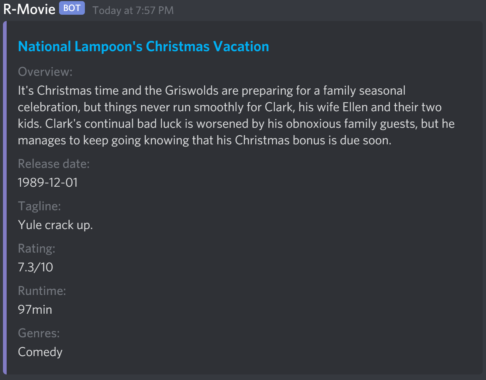

### Discord bot
- randomizes movie by genre(s)
- utilizes [tMDB](https://developers.themoviedb.org/3/getting-started/introduction).
- hosted on Heroku

| **Commands:** | Description |
| --- | ---|
| !help  | Will remind you the commands and genres |
|!movie [genre ...] | Returns a random movie in specified genre(s) (Top 1000 if possible)|
|!movie_p [genre ...] | Returns a random movie in specified genre(s) (Top 100 if possible)|

| **Genres:** |  | | |  |
| --- | --- | --- | --- | --- |
| action | adventure | animation | comedy | crime
| documentary | drama | family | fantasy | history 
| horror | music | mystery | romance | science_fiction 
| tv_movie | thriller | war | western | random

## Syntax Example:
Input: !movie_p action adventure 
Output: A movie (in the top 100) that includes those two specific genres.

## Picture Example: (!movie comedy)

